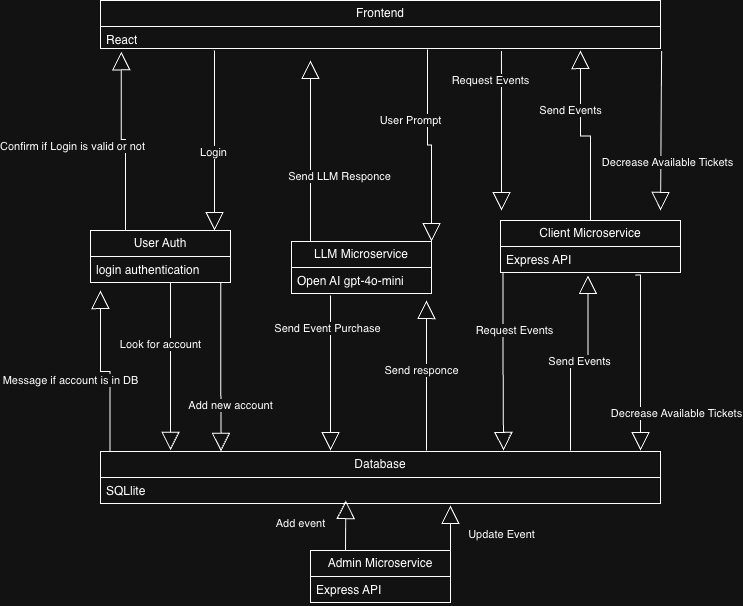
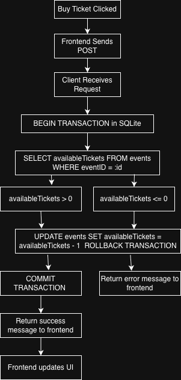

## TigerTix Architecture Diagram

## Ticket Booking Data Flow

The Tiger Tix system integrates two micro-services that interact with the shared database. The first micro-service is the admin micro-service. This micro-service is not connected to the front end, but can be used to post or update events in the shared database. The client micro-service allows the Frontend to interact with the shared database. The Frontend can get the information about the events that are stored in the database, then display them for the user. When the user requests to buy a ticket on the Frontend, the Frontend then uses the client micro-service to update the availability in the database. 

If there is no availability for the event listed in the database, the client can then inform the Frontend of this and let the user know they can not act on buying the ticket. Users can also interact with the LLM agent to book tickets. This agent micro-service communicates with the user in the Frontend and then sends a POST purchase request to the database, and once the database responds, the LLM reacts accordingly to the response (e.g., saying tickets unavailable or notifying the user that the purchase was successful) 

For the user in the Frontend to use the client service, the user must first use the user authentication service. If a user does not have an account, they can first use the account registration field to use the user authentication service to register their account in the database. Then, the user can send a login request from the Frontend login fields. The user authentication service can then see if the login is in the database, and send back a confirmation that the account is in or not in the database. 

